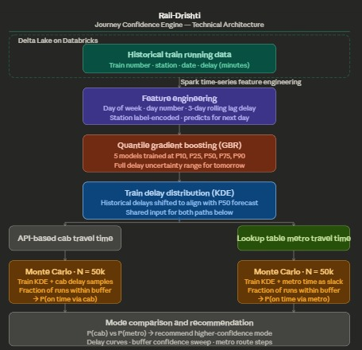

# Route Optimizer — Journey Risk Analyser

A Streamlit app that tells you the probability of catching your train given real Delhi traffic and historical train delay data, comparing cab vs. metro as your first-mile option.

---

## Architecture



```
┌─────────────────────────────────────────────────────────────────┐
│                        Databricks Platform                      │
│                                                                 │
│  Unity Catalog / Volumes                                        │
│  ┌──────────────────────────────────────────────────────────┐   │
│  │  /Volumes/hackathon/default/train_running_history/       │   │
│  │    • all_trains_history.csv  (train delay history)       │   │
│  │    • delhi_traffic.csv       (bus/cab trip data)         │   │
│  │    • Delhi_metro.csv         (metro station graph)       │   │
│  └──────────────────────────────────────────────────────────┘   │
│              │                                                  │
│              │  databricks-sdk  (WorkspaceClient.files.download)│
│              ▼                                                  │
│  ┌──────────────────────────────────────────────────────────┐   │
│  │               Databricks App (app.yaml)                  │   │
│  │                                                          │   │
│  │  app.py                    metro_routing.py              │   │
│  │  ┌──────────────────┐      ┌──────────────────────────┐  │   │
│  │  │ ML Layer         │      │ Metro Graph Engine       │  │   │
│  │  │ GradientBoosting │      │ Dijkstra shortest path   │  │   │
│  │  │ Quantile Regress │      │ Haversine distance       │  │   │
│  │  │ KDE distributions│      │ Nominatim geocoding      │  │   │
│  │  └────────┬─────────┘      └────────────┬─────────────┘  │   │
│  │           │                             │                 │   │
│  │           └─────────────┬───────────────┘                 │   │
│  │                         ▼                                 │   │
│  │              Streamlit UI (sidebar + charts)              │   │
│  │              P(on time) · KDE plots · Buffer curve        │   │
│  └──────────────────────────────────────────────────────────┘   │
└─────────────────────────────────────────────────────────────────┘
```

**Component roles:**

| Component | Role |
|---|---|
| Databricks Unity Catalog Volumes | Stores all three datasets; accessed at runtime via the SDK |
| `databricks-sdk` `WorkspaceClient` | Authenticated read from Volumes — no credentials in code |
| `app.py` | Loads data, trains quantile-regression models, computes KDEs, renders Streamlit UI |
| `metro_routing.py` | Builds a weighted metro station graph, runs Dijkstra, geocodes free-text addresses via Nominatim |
| `app.yaml` | Declares the Databricks App entry point (`streamlit run app.py`) |

---

## How to Run

### Prerequisites

- A Databricks workspace with the three CSV files uploaded to  
  `/Volumes/hackathon/default/train_running_history/`
- Python 3.10+
- Databricks CLI configured (`databricks configure`) **or** the environment variables  
  `DATABRICKS_HOST` and `DATABRICKS_TOKEN` set

### Install dependencies

```bash
pip install -r requirements.txt
```

### Run locally

```bash
streamlit run app.py
```

The app will open at `http://localhost:8501`.

### Deploy as a Databricks App

```bash
databricks apps deploy --source-code-path . route-optimizer
```

Then open the app URL shown in the Databricks Apps UI.

---

## Demo Steps

1. **Open the app** — the sidebar appears on the left.

2. **Pick your train:**
   - Under **Train**, choose *Search by* → `Train Number` or `Station`.
   - Select a train number (e.g. `12301`) and the station where you board.

3. **Pick your road leg:**
   - Under **Bus / Cab**, leave *Start Location* on `Select Area` and choose an area (e.g. `India Gate`).
   - Set *End Location* to the area nearest your train station (e.g. `Chandni Chowk`).
   - Or switch either input to `Type Address` and enter a free-text Delhi address — the app geocodes it and snaps it to the nearest metro station automatically.

4. **Set time remaining:**
   - Under **Time Remaining**, enter how many minutes you have until the train's scheduled departure (e.g. `45`).

5. **Click `🔍 Analyse Journey`.**

6. **Read the results:**
   - The **Travel Options Comparison** panel shows estimated travel time and `P(catch train)` for both cab and metro.
   - Expand **View Metro Path** to see the line-by-line routing instructions.
   - The three charts below show:
     - Train delay distribution (quantile bands, P10/P50/P90)
     - Cab travel time distribution
     - Combined journey confidence (on-time vs. late probability at your chosen buffer)
     - Buffer-vs-probability curve — shows the minimum buffer needed for 80 % confidence

---

## Datasets

| File | Description |
|---|---|
| `all_trains_history.csv` | Daily delay records per train and station |
| `delhi_traffic.csv` | Cab/bus trip records with distance, speed, time of day, weather, and traffic density |
| `Delhi_metro.csv` | Delhi Metro station list with line, coordinates, and sequential IDs |